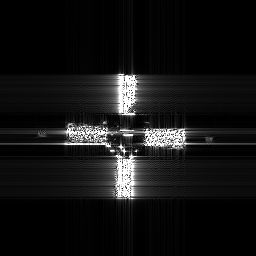
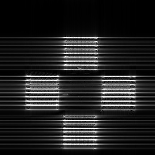
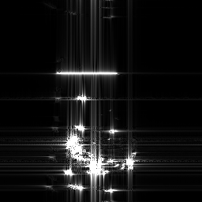
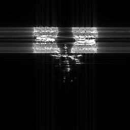
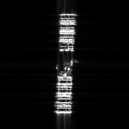
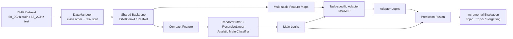

# ISAR-CIL
# ISAR-CIL

<p align="center">
  
</p>


<p align="center">
  A class-incremental learning framework for ISAR target recognition.
</p>


`ISAR-CIL` is a configuration-driven project for `ISAR (Inverse Synthetic Aperture Radar)` class-incremental learning. It integrates multiple continual learning baselines and includes a custom ACIL-style method with task-specific adapter branches for more stable incremental recognition on ISAR imagery.

## What This Project Targets

In practical ISAR recognition settings, new target classes arrive over time. A model is first trained on a small set of base classes and then has to absorb new classes without catastrophically forgetting previously learned ones. This repository is built to support that setting by focusing on:

- class-incremental learning for ISAR target recognition
- unified benchmarking across multiple CIL methods
- analytic incremental classification without exemplar replay in the main stream
- task-specific compensation branches for new class adaptation

## Key Features

- Built-in ISAR dataset pipeline through `DataManager`
- Standard `init_cls + increment` class-incremental protocol
- Analytic main classifier based on `RecursiveLinear`
- Task-specific adapters for local logit refinement
- Both `Conv4` and `ResNet` backbone variants
- Multiple baselines under a unified training loop for fair comparison

## Example Samples

The following examples are copied from the ISAR training split in this repository to give a quick sense of the data format.

<p align="center">
  
  
  
  
</p>


<p align="center">
  
  
  
  
</p>


## Method Overview

The main custom methods in this repository are:

- `acil_spec_branch`
- `acil_spec_branch_resnet`

Their high-level idea is:

1. Use a shared backbone to extract ISAR features.
2. Use an ACIL-style analytic classifier as the main incremental classification stream.
3. Add a task-specific adapter branch for each incremental step to refine predictions on the current class range.

This design separates global class-incremental stability from task-local compensation, which is useful when balancing old-class retention and new-class adaptation.

## Overall Architecture



### Training Flow

1. Base stage:
    train the shared feature extractor on the initial classes.
2. Main incremental stage:
    replace the temporary classifier with an analytic classifier and update it incrementally.
3. Adapter stage:
    attach one `TaskMLP` branch per task and train it on the newly introduced classes.
4. Inference stage:
    fuse main-stream logits and adapter logits to obtain the final prediction.

### Main Code Mapping

- `main.py`: command-line entry point
- `trainer.py`: unified training and evaluation loop
- `utils/data_manager.py`: dataset loading, task split, and label remapping
- `utils/inc_net.py`: backbone, buffer, analytic head, and adapter orchestration
- `convs/commom_branch.py`: `ISARConv4` shared backbone
- `convs/sub_branch.py`: task-specific adapter branch `TaskMLP`
- `models/acil_spec_branch.py`: custom `Conv4` version
- `models/acil_spec_branch_resnet.py`: custom `ResNet` version

## Repository Structure

```text
ISAR-CIL/
|-- main.py
|-- trainer.py
|-- exps/                  # experiment configurations
|-- models/                # continual learning methods
|-- convs/                 # backbones, branches, and linear heads
|-- utils/                 # data manager, toolkit, incremental net
|-- data/isar/             # ISAR dataset folders
|-- logs/                  # training logs and outputs
|-- resources/             # README assets
`-- README.md
```

## Included Methods

Besides the custom ISAR-oriented methods, the repository also keeps several standard CIL baselines for comparison, including:

- `iCaRL`
- `BiC`
- `PODNet`
- `LwF`
- `EWC`
- `DER`
- `Replay`
- `GEM`
- `FOSTER`
- `MEMO`
- `SimpleCIL`
- `ACIL`
- `TagFex`

See `utils/factory.py` for the method registry.

## Dataset Layout

The built-in ISAR loader currently expects the following folder layout:

```text
data/
`-- isar/
    |-- 50_2GHz/   # training split
    `-- 55_2GHz/   # test split
```

The class order is defined in `utils/data.py` under `iISAR.class_order`. The default experimental setting is:

- `init_cls = 6`
- `increment = 4`

## Quick Start

### 1. Prepare data

Arrange ISAR images in `ImageFolder` style:

```text
data/isar/50_2GHz/<class_name>/*.png
data/isar/55_2GHz/<class_name>/*.png
```

### 2. Choose an experiment config

Default configs are provided in:

- `exps/acil_spec.json`
- `exps/acil_spec_resnet.json`

These configs define the dataset split, backbone type, buffer size, analytic classifier parameters, and adapter fusion mode.

### 3. Run training

```bash
python main.py --config ./exps/acil_spec.json
```

For the ResNet version:

```bash
python main.py --config ./exps/acil_spec_resnet.json
```

Logs and outputs are stored under:

```text
logs/<model_name>/<dataset_name>/<init_cls>/<increment>/
```

## Important Config Fields

Some key fields in `exps/acil_spec.json` are:

- `dataset_name`: dataset name, `isar` for the ISAR setup
- `init_cls`: number of classes in the base task
- `increment`: number of classes introduced at each incremental step
- `convnet_type`: backbone type such as `isarconv4`
- `buffer_size`: feature buffer dimension used by the analytic classifier
- `gamma`: regularization term for analytic learning
- `sub_fusion_mode`: fusion mode for the task-specific branch, such as `cat` or `add`
- `draw_heatmap`: whether to export intermediate feature heatmaps

## Reported Outputs

During training and evaluation, the framework records:

- grouped accuracy after each task
- `Top-1` and `Top-5` accuracy
- average accuracy across tasks
- forgetting metrics

These are written to log files and are convenient for plotting and comparison.

## Use Cases

This repository is suitable for:

- ISAR class-incremental learning experiments
- baseline reproduction and comparison under a unified pipeline
- extending ACIL-style analytic learning for radar imagery
- studying old/new class balance and forgetting reduction

## Notes

- The current `requirements.txt` is closer to an exported environment than to a minimal dependency list.
- For a clean reproduction setup, the core dependencies are typically `PyTorch`, `torchvision`, `numpy`, `Pillow`, and `tqdm`.
- If this project is useful for your research, feel free to star it or build on top of it.
